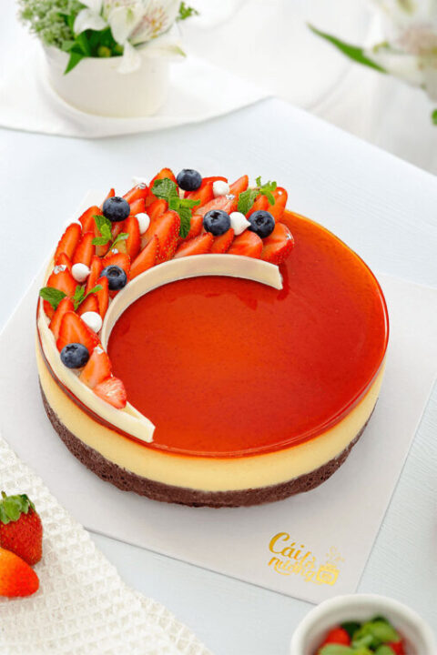

# 📚 **ÔN TẬP BẢO VỆ MÔN - DỰ ÁN ONTAP**

<div align="center">


**Dự án ôn tập tổng hợp kiến thức HTML, CSS & JavaScript cơ bản**
*Chuẩn bị cho kỳ thi bảo vệ môn học*

</div>

---

## 🎯 **Mục tiêu dự án**

- ✅ **Ôn tập kiến thức cơ bản** HTML, CSS, JavaScript
- ✅ **Thực hành các bài tập** thường gặp trong đề thi
- ✅ **Nắm vững DOM manipulation** và Event handling
- ✅ **Hiểu rõ CSS layout** và responsive design
- ✅ **Chuẩn bị tốt** cho kỳ thi bảo vệ môn

---

## 📁 **Cấu trúc dự án**

```
ASM/OnTap/
├── 📁 cau1_1.html          # Image Slider
├── 📁 cau2_1.html          # Login Form
├── 📁 cau3_1.html          # Product List & Shopping Cart (sẽ tạo)
├── 📁 assets/
│   ├── 📁 images/          # Hình ảnh cho slider
│   └── 📁 css/             # Stylesheets (sẽ tạo)
├── 📁 js/                  # JavaScript files (sẽ tạo)
└── 📁 README.md            # Tài liệu này
```

---

## 🚀 **Bài tập 1: Image Slider (cau1_1.html)**

### 📋 **Yêu cầu bài tập:**
- Tạo Image Slider với 3 ảnh
- Nút Previous/Next để chuyển ảnh
- Hiển thị vị trí ảnh hiện tại (1/3, 2/3, 3/3)
- Vòng lặp: ảnh cuối → ảnh đầu, ảnh đầu → ảnh cuối

### 💻 **Code quan trọng:**

#### **HTML Structure:**
```html
<div class="container">
    <h2>Image Slider</h2>
    
    <div class="image-counter">
        <span id="currentIndex">1</span> / <span id="totalImages">3</span>
    </div>
</div>

<div class="controls">
    <button onclick="prev()">Previous</button>
    <button onclick="next()">Next</button>
</div>
```

#### **JavaScript Logic:**
```javascript
// Khai báo mảng ảnh TRƯỚC khi sử dụng
let images = [
    "./assets/images/flan-1.jpg",
    "./assets/images/flan-2.jpg",
    "./assets/images/flan-3.jpg",
];

let i = 0; // Bắt đầu từ index 0

// Function để cập nhật ảnh
function updateImage() {
    const currentImage = document.getElementById('currentImage');
    const currentIndex = document.getElementById('currentIndex');
    
    currentImage.src = images[i];
    currentIndex.textContent = i + 1;
}

// Function Previous
function prev() {
    i--;
    if (i < 0) {
        i = images.length - 1; // Về ảnh cuối
    }
    updateImage();
}

// Function Next
function next() {
    i++;
    if (i >= images.length) {
        i = 0; // Về ảnh đầu
    }
    updateImage();
}
```

### 🎨 **CSS Styling:**
```css
body {
    display: flex;
    flex-direction: column;
    justify-content: center;
    align-items: center;
    background: linear-gradient(135deg, #667eea 0%, #764ba2 100%);
}

.container {
    background: white;
    padding: 30px;
    border-radius: 15px;
    box-shadow: 0 10px 30px rgba(0,0,0,0.3);
}

.images {
    width: 400px;
    height: 300px;
    object-fit: cover;
    border-radius: 10px;
}
```

### 🔑 **Kiến thức cần nhớ:**
- **Array indexing:** Bắt đầu từ 0, kết thúc ở `length - 1`
- **Circular navigation:** `i < 0` → `i = length - 1`, `i >= length` → `i = 0`
- **DOM manipulation:** `getElementById()`, `src`, `textContent`
- **CSS Flexbox:** `display: flex`, `justify-content`, `align-items`

---

## 🚀 **Bài tập 2: Login Form (cau2_1.html)**

### 📋 **Yêu cầu bài tập:**
- Form đăng nhập với username và password
- Validate thông tin đăng nhập
- Hiển thị thông báo thành công/thất bại
- Giao diện đẹp, responsive

### 💻 **Code quan trọng:**

#### **HTML Structure:**
```html
<div class="container">
    <h2>Đăng Nhập</h2>
    <form id="loginForm">
        <div class="form-group">
            <label for="user">Username:</label>
            <input type="text" id="user" placeholder="Nhập username" required>
        </div>
        
        <div class="form-group">
            <label for="password">Password:</label>
            <input type="password" id="password" placeholder="Nhập password" required>
        </div>
        
        <button type="submit">Đăng Nhập</button>
    </form>
    
    <div id="message" class="message"></div>
</div>
```

#### **JavaScript Logic:**
```javascript
// Sửa selector: dùng ID thay vì class
let userInput = document.getElementById("user");
let passwordInput = document.getElementById("password");
let messageDiv = document.getElementById("message");
let loginForm = document.getElementById("loginForm");

// Thêm event listener cho form
loginForm.addEventListener("submit", function(e) {
    e.preventDefault();
    kiemTra();
});

function kiemTra() {
    let username = userInput.value.trim();
    let password = passwordInput.value.trim();
    
    // Kiểm tra username và password
    if (username === "admin" && password === "123") {
        showMessage("Đăng nhập thành công! Chào mừng bạn!", "success");
        loginForm.reset();
    } else {
        showMessage("Đăng nhập thất bại! Kiểm tra lại username và password!", "error");
    }
}

function showMessage(text, type) {
    messageDiv.textContent = text;
    messageDiv.className = `message ${type}`;
    messageDiv.style.display = "block";
    
    // Ẩn message sau 3 giây
    setTimeout(() => {
        messageDiv.style.display = "none";
    }, 3000);
}
```

### 🎨 **CSS Styling:**
```css
body {
    display: flex;
    justify-content: center;
    align-items: center;
    height: 100vh;
    background: linear-gradient(135deg, #667eea 0%, #764ba2 100%);
}

.container {
    background: white;
    padding: 40px;
    border-radius: 15px;
    box-shadow: 0 10px 30px rgba(0,0,0,0.3);
}

input:focus {
    outline: none;
    border-color: #667eea;
    box-shadow: 0 0 10px rgba(102, 126, 234, 0.3);
}

.message.success {
    background-color: #d4edda;
    color: #155724;
}

.message.error {
    background-color: #f8d7da;
    color: #721c24;
}
```

### 🔑 **Kiến thức cần nhớ:**
- **Form handling:** `addEventListener("submit")`, `preventDefault()`
- **Input validation:** `trim()`, `===` comparison
- **DOM manipulation:** `getElementById()`, `value`, `className`
- **CSS classes:** Dynamic class assignment cho styling
- **setTimeout:** Auto-hide messages

---

## 🚀 **Bài tập 3: Product List & Shopping Cart (cau3_1.html) - SẼ TẠO**

### 📋 **Yêu cầu bài tập:**
- Hiển thị danh sách sản phẩm dạng grid
- Thêm sản phẩm vào giỏ hàng
- Tính tổng tiền giỏ hàng
- Xóa sản phẩm khỏi giỏ hàng

### 💻 **Code sẽ tạo:**

#### **HTML Structure:**
```html
<div class="container">
    <h1>Danh Sách Sản Phẩm</h1>
    <div class="products-grid" id="productsGrid">
        <!-- Sản phẩm sẽ được hiển thị ở đây bằng JavaScript -->
    </div>
    
    <div class="cart-section">
        <h2>Giỏ Hàng</h2>
        <div class="cart-table">
            <table id="cartTable">
                <thead>
                    <tr>
                        <th>Tên sản phẩm</th>
                        <th>Hình ảnh</th>
                        <th>Giá</th>
                        <th>Số lượng</th>
                        <th>Tổng</th>
                        <th>Thao tác</th>
                    </tr>
                </thead>
                <tbody id="cartBody">
                    <!-- Giỏ hàng sẽ được hiển thị ở đây -->
                </tbody>
            </table>
        </div>
        <div class="cart-total">
            <h3>Tổng tiền: <span id="totalAmount">0</span> VNĐ</h3>
        </div>
    </div>
</div>
```

#### **JavaScript Logic:**
```javascript
// Dữ liệu sản phẩm
let products = [
    { id: 1, name: "Laptop Dell", price: 15000000, image: "laptop.jpg" },
    { id: 2, name: "iPhone 15", price: 25000000, image: "iphone.jpg" },
    { id: 3, name: "Samsung Galaxy", price: 20000000, image: "samsung.jpg" }
];

let cart = [];

// Hiển thị sản phẩm
function displayProducts() {
    const productsGrid = document.getElementById('productsGrid');
    productsGrid.innerHTML = '';
    
    products.forEach(product => {
        const productCard = document.createElement('div');
        productCard.className = 'product-card';
        productCard.innerHTML = `
            
            <h3>${product.name}</h3>
            <p class="price">${product.price.toLocaleString()} VNĐ</p>
            <button onclick="addToCart(${product.id})">Thêm vào giỏ</button>
        `;
        productsGrid.appendChild(productCard);
    });
}

// Thêm vào giỏ hàng
function addToCart(productId) {
    const product = products.find(p => p.id === productId);
    const existingItem = cart.find(item => item.id === productId);
    
    if (existingItem) {
        existingItem.quantity++;
    } else {
        cart.push({ ...product, quantity: 1 });
    }
    
    updateCart();
}

// Cập nhật giỏ hàng
function updateCart() {
    const cartBody = document.getElementById('cartBody');
    const totalAmount = document.getElementById('totalAmount');
    
    cartBody.innerHTML = '';
    let total = 0;
    
    cart.forEach(item => {
        const row = document.createElement('tr');
        const itemTotal = item.price * item.quantity;
        total += itemTotal;
        
        row.innerHTML = `
            <td>${item.name}</td>
            <td></td>
            <td>${item.price.toLocaleString()} VNĐ</td>
            <td>${item.quantity}</td>
            <td>${itemTotal.toLocaleString()} VNĐ</td>
            <td><button onclick="removeFromCart(${item.id})">Xóa</button></td>
        `;
        cartBody.appendChild(row);
    });
    
    totalAmount.textContent = total.toLocaleString();
}

// Xóa khỏi giỏ hàng
function removeFromCart(productId) {
    cart = cart.filter(item => item.id !== productId);
    updateCart();
}
```

### 🎨 **CSS Styling:**
```css
.products-grid {
    display: grid;
    grid-template-columns: repeat(auto-fit, minmax(250px, 1fr));
    gap: 20px;
    margin-bottom: 40px;
}

.product-card {
    background: white;
    border-radius: 10px;
    padding: 20px;
    text-align: center;
    box-shadow: 0 5px 15px rgba(0,0,0,0.1);
    transition: transform 0.3s ease;
}

.product-card:hover {
    transform: translateY(-5px);
}

.cart-table {
    background: white;
    border-radius: 10px;
    overflow: hidden;
    box-shadow: 0 5px 15px rgba(0,0,0,0.1);
}

.cart-table table {
    width: 100%;
    border-collapse: collapse;
}

.cart-table th,
.cart-table td {
    padding: 15px;
    text-align: left;
    border-bottom: 1px solid #eee;
}

.cart-image {
    width: 50px;
    height: 50px;
    object-fit: cover;
    border-radius: 5px;
}
```

### 🔑 **Kiến thức cần nhớ:**
- **Array methods:** `find()`, `filter()`, `forEach()`
- **DOM manipulation:** `createElement()`, `innerHTML`, `appendChild()`
- **Event handling:** `onclick` functions
- **CSS Grid:** `grid-template-columns`, `auto-fit`
- **Object spread:** `{ ...product, quantity: 1 }`

---

## 📚 **Kiến thức tổng hợp cần ôn**

### 🎯 **HTML Fundamentals:**
- **Semantic elements:** `<div>`, `<form>`, `<table>`, ``
- **Form elements:** `<input>`, `<button>`, `<label>`
- **Attributes:** `id`, `class`, `onclick`, `src`, `alt`

### 🎨 **CSS Fundamentals:**
- **Layout:** Flexbox, Grid, Box model
- **Styling:** Colors, fonts, borders, shadows
- **Responsive:** Media queries, viewport units
- **Animations:** Transitions, transforms, hover effects

### ⚡ **JavaScript Fundamentals:**
- **Variables:** `let`, `const`, scope
- **Functions:** Declaration, parameters, return values
- **DOM API:** `getElementById()`, `querySelector()`, `addEventListener()`
- **Arrays:** Methods, iteration, manipulation
- **Objects:** Properties, methods, spread operator
- **Events:** Click, submit, keydown, form events

### 🔧 **DOM Manipulation:**
```javascript
// Lấy element
const element = document.getElementById('id');
const element = document.querySelector('.class');

// Thay đổi nội dung
element.textContent = 'text';
element.innerHTML = '<span>HTML</span>';

// Thay đổi thuộc tính
element.src = 'new-image.jpg';
element.className = 'new-class';

// Tạo element mới
const newElement = document.createElement('div');
newElement.innerHTML = 'Content';
parentElement.appendChild(newElement);
```

### 📱 **Event Handling:**
```javascript
// Click event
element.onclick = function() { /* code */ };
element.addEventListener('click', function() { /* code */ };

// Form submit
form.addEventListener('submit', function(e) {
    e.preventDefault(); // Ngăn form reload trang
    // Xử lý form
});

// Input change
input.addEventListener('input', function() {
    // Xử lý khi user gõ
});
```

---

## 🎯 **Tips ôn thi hiệu quả**

### 📝 **1. Thực hành code:**
- Chạy từng bài tập nhiều lần
- Sửa đổi code để hiểu rõ logic
- Tạo thêm tính năng mới

### 🧠 **2. Ghi nhớ syntax:**
- HTML structure cơ bản
- CSS properties quan trọng
- JavaScript methods thường dùng

### 🔍 **3. Debug skills:**
- Sử dụng `console.log()` để kiểm tra
- Mở Developer Tools (F12)
- Kiểm tra lỗi trong Console

### 📚 **4. Ôn tập theo chủ đề:**
- **DOM:** getElementById, querySelector, innerHTML
- **Events:** onclick, addEventListener, preventDefault
- **CSS:** Flexbox, Grid, responsive design
- **JavaScript:** Arrays, Objects, Functions

---

## 🚀 **Chuẩn bị cho kỳ thi**

### ✅ **Checklist trước khi thi:**
- [ ] Hiểu rõ cách hoạt động của từng bài tập
- [ ] Nắm vững syntax HTML, CSS, JavaScript
- [ ] Biết cách debug và sửa lỗi
- [ ] Thực hành tạo project mới từ đầu
- [ ] Ôn tập các khái niệm cơ bản

### 🎯 **Các dạng bài thường gặp:**
1. **Form handling** với validation
2. **Image gallery** hoặc slider
3. **Shopping cart** hoặc todo list
4. **DOM manipulation** và event handling
5. **CSS layout** và responsive design

### 💡 **Lời khuyên khi thi:**
- **Đọc kỹ đề bài** trước khi code
- **Plan trước** cấu trúc HTML và logic JS
- **Test từng phần** trước khi làm tiếp
- **Giữ code clean** và có comment
- **Kiểm tra lỗi** trước khi nộp

---

## 🎉 **Kết luận**

Dự án OnTap này giúp bạn:
- **Ôn tập kiến thức** HTML, CSS, JavaScript cơ bản
- **Thực hành các bài tập** thường gặp trong đề thi
- **Nắm vững DOM manipulation** và event handling
- **Chuẩn bị tốt** cho kỳ thi bảo vệ môn

**Chúc bạn thi tốt và đạt kết quả cao! 🚀**

---

<div align="center">

**"Practice makes perfect" - Thực hành tạo nên sự hoàn hảo! 💪**

[](https://github.com/your-username)
[](https://linkedin.com/in/your-profile)

</div>
